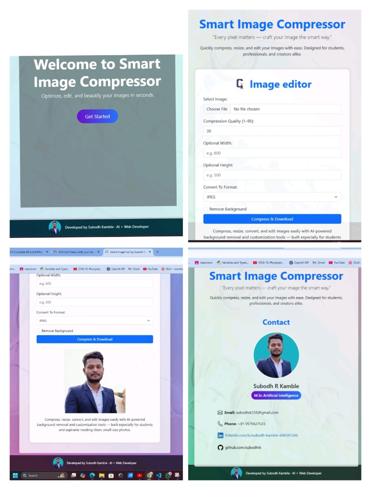

# 🧠 Smart Image Compressor & Background Remover

A Python Flask web application that allows users to:
- Compress images to reduce file size  
- Resize images to custom dimensions  
- Convert between formats (JPG, PNG, WEBP, etc.)  
- Remove background using AI (Rembg + U-2-Net)  
- Download the processed image instantly  

🔗 **Live App:** [Smart Image Compressor on Render](https://smart-image-compressor-1.onrender.com/)

---

## 🚀 Features

- ✅ Upload any image (`.jpg`, `.png`, `.heic`, `.cr2`, `.arw`, `.dng`, etc.)  
- ✅ Resize to custom width and height  
- ✅ Adjust image quality (0–100)  
- ✅ Background removal with custom color  
- ✅ Format conversion (`JPG`, `PNG`, `WEBP`, etc.)  
- ✅ Download-ready processed image  
- ✅ Clean Bootstrap UI with sidebar navigation  

---

## 🛠️ Tech Stack

- **Backend:** Flask (Python)  
- **Frontend:** HTML, CSS, Bootstrap 5  
- **Image Processing:**  
  - `Pillow` for compression/resizing  
  - `rembg` for AI background removal  
  - `rawpy` for RAW file support  
  - `pillow-heif` for `.heic` files  

---

## 📷 Demo – App Screenshots



## 📁 Project Structure

```
smart-image-app/
├── app.py                 # Flask backend (main logic)
├── templates/             # HTML templates
│   ├── index.html         # Main UI page
│   ├── about.html         # About page
│   ├── faq.html           # FAQ/help section
│   └── contact.html       # Contact form page
├── static/                # Static assets: CSS, images
│   ├── styles.css         # Custom styling
│   ├── screenshot.png     # App demo screenshot
│   ├── screenshot2.png
│   ├── screenshot3.png
│   └── screenshot4.png
├── requirements.txt       # Python dependencies
└── README.md              # Project documentation
```

---

## 🙌 Contributing

Pull requests are welcome. For major changes, please open an issue first to discuss what you would like to change.

---

## 📜 License

Dr Bamu License  
Copyright © 2025 Subodh Kamble

Permission is granted to use, copy, modify, and distribute this software for any purpose, with or without fee, provided that the above copyright notice appears in all copies.

THE SOFTWARE IS PROVIDED "AS IS", WITHOUT WARRANTY OF ANY KIND.


---

⭐ If you like this project, give it a star!
